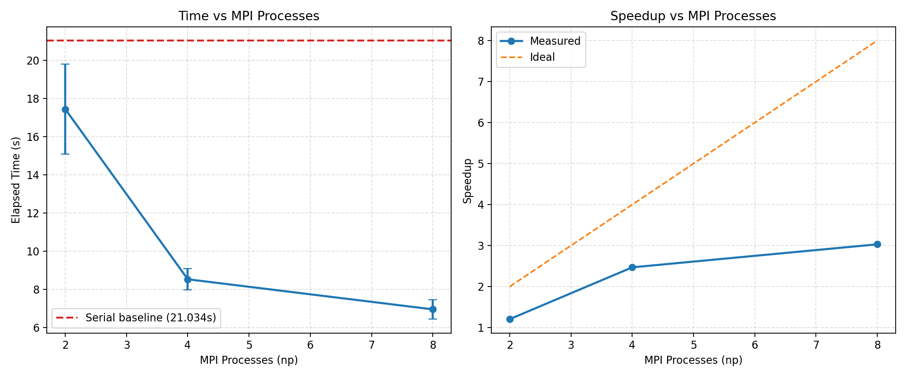

# MPI Distributed Token Search on 10 GB Corpora

## 1) Abstract & Architecture Overview

This project implements a distributed, high-throughput token-search engine in C/MPI for very large text corpora, with a primary target workload of **10 GB**. The objective is to identify all occurrences of a query token with strict correctness guarantees (including whole-word semantics and chunk/rank boundary safety), while collecting reproducible timing data across multiple process counts.

The computational model follows a **master-worker style SPMD workflow** under MPI. All ranks execute the same binary (`dist_search`), but Rank 0 acts as the orchestration and aggregation endpoint: it broadcasts file metadata, gathers per-rank results, performs global sorting, and executes final annotation/output steps. Worker ranks execute the same search pipeline over disjoint byte ownership regions and report compact results back to Rank 0.

Containerization is provided through a shared `Dockerfile` and a dual-network Compose topology that simulates realistic cluster separation of concerns:
- `frontend_net` (bridge): management/orchestration plane.
- `compute_net` (bridge + `internal: true`): isolated data plane for MPI exchange.

Under this topology, the `master` service is attached to both networks for user-facing orchestration and cluster control, while `worker` services are attached **only** to `compute_net`, creating a front-end control node and isolated compute backplane similar to production HPC cluster design patterns.

## 2) Core Algorithmic Engine

### 2.1 Boyer-Moore-Horspool (BMH) in `search_utils.c`

The search core is based on **Boyer-Moore-Horspool** (BMH), implemented through:
- `bmh_preprocess(...)`: constructs a 256-entry bad-character skip table.
- `bmh_search(...)`: scans each buffer window using right-to-left comparisons and skip jumps.

Preprocessing initializes all skip entries to `tlen` (pattern length), then overwrites entries for pattern characters except the last:

\[
\text{skip}[token[i]] = tlen - 1 - i,\quad i \in [0, tlen-2]
\]

At runtime, upon mismatch at candidate window position `pos`, the algorithm advances by:

\[
pos \leftarrow pos + \text{skip}[buf[pos + tlen - 1]]
\]

instead of incrementing by 1 (naive scan behavior).

### 2.2 Why BMH Outperforms Naive Matching on Massive Inputs

For naive matching, each alignment compares up to `tlen` characters and usually advances one byte, causing heavy redundant work over multi-gigabyte text. BMH reduces comparisons and, more importantly, **increases average shift distance** when mismatch statistics are favorable (typical in natural-language-like corpora or seeded sparse tokens). On 10 GB files, these larger jumps significantly reduce CPU instructions and branch pressure in the search phase. This directly improves per-rank throughput and makes chunked streaming practical at scale.

### 2.3 Whole-Word Semantics

`is_word_boundary(...)` checks both left and right token boundaries using alphanumeric/underscore tests (`isalnum` or `_`). This ensures lexical-token matching (not arbitrary substring hits) when `--whole-word 1` is enabled, preserving semantic correctness for benchmarking and evaluation.

## 3) Boundary Handling & Data Tricks (Crucial Section)

### 3.1 Right Overlap: Why `token_len - 1` Extra Bytes Are Read

Each rank owns a byte interval:

\[
[my\_start,\ my\_end)
\]

and processes it in subwindows `[cur, cur + own_len)`. To avoid missing matches that start near the right edge and finish in the next chunk/rank region, each subwindow reads:

\[
right\_extra = token\_len - 1
\]

(clamped at EOF). This is the minimum suffix needed so any token whose **start** lies in owned bytes can still be fully validated even if it crosses the nominal boundary.

### 3.2 Left Context: Why 1 Byte Is Enough

For strict whole-word enforcement, the algorithm must inspect the character immediately preceding a candidate start offset. At nonzero offsets, one-byte left context:

\[
left\_extra = 1
\]

is sufficient to evaluate boundary legality at chunk/rank starts. Without this byte, a token at the first owned position could be misclassified because its left lexical context would be unknown.

### 3.3 Rule of Ownership (Anti-Duplication Guarantee)

After searching an extended buffer, each candidate match offset `off` is accepted only if:
- it starts in the current owned subwindow, and
- it belongs to this rank's global ownership range.

Implemented predicate:

\[
off \ge cur \land off < cur + own\_len \land off \ge my\_start \land off < my\_end
\]

This **Rule of Ownership** is the key distributed-correctness invariant: overlaps are read for visibility, but only the owner of the start byte records the match. Therefore, boundary-spanning tokens are found exactly once with no distributed double counting.

## 4) Memory Management & I/O Optimizations

### 4.1 OOM Prevention via Streaming (`--chunk-mb`)

The main loop in `mpi_search.c` avoids loading whole ownership ranges into RAM. Instead, each rank repeatedly processes bounded subwindows with:

\[
own\_len = \min(my\_remaining,\ chunk\_bytes)
\]

where `chunk_bytes = --chunk-mb * 1024 * 1024`.

This design turns a potentially unbounded memory footprint into a controllable one, enabling robust operation on large files and modest-memory machines. It also improves fault isolation: if a chunk fails, the process has not committed to a monolithic in-memory state.

### 4.2 Two-Pass Annotation Trick

The search phase stores only **global byte offsets** for matches. Line/column coordinates are deferred and computed once by Rank 0 using `annotate_line_col_from_file(...)` in a single sequential file pass after global gather + sort.

This separation is a major optimization:
- During parallel search, ranks avoid expensive per-character line/column maintenance in high-frequency loops.
- Final annotation cost is paid once, centrally, and only for sorted offsets.
- Network payload remains compact (offset-centric match records).

Net effect: faster hot-path search and reduced distributed overhead.

### 4.3 Dynamic Struct Vectors (`MatchVec`)

Because match density can be unpredictable, local results are stored in a dynamic vector with geometric growth (`capacity *= 2`). This amortizes reallocation cost and avoids fragile fixed limits. Similar growth logic is used for temporary per-buffer scratch match storage, preventing truncation when local hit counts exceed initial expectations.

### 4.4 Buffered File I/O Strategy

`read_range(...)` uses explicit buffered stdio (`setvbuf` with 64 MB) to amortize syscall overhead and improve sequential read efficiency during chunk streaming. Combined with rank-level partitioning and bounded chunk sizes, this creates a practical balance between I/O throughput and memory safety.

### 4.5 DRY Refactor: Unified Streaming/Search Component

The implementation now applies the DRY principle by extracting the duplicated chunk-streaming + overlap-read + BMH-scan loop into a single reusable helper (`stream_and_collect_offsets(...)`) inside `mpi_search.c`. Both `search_once(...)` (MPI path) and `serial_search_once(...)` (serial baseline path) invoke this same helper with different ownership windows (`[my_start,my_end)` vs `[0,file_size)`), so the boundary logic, scratch-buffer growth, and ownership filtering are maintained in one canonical place.

This refactor improves engineering quality in three ways:
- eliminates drift risk between serial and distributed logic,
- reduces maintenance cost for future algorithmic changes,
- preserves correctness invariants identically across execution modes.

## 5) MPI Communication Protocol

### 5.1 Collective Flow

The distributed protocol combines:
- `MPI_Bcast` for global file size dissemination.
- `MPI_Reduce` for total-count sanity aggregation.
- `MPI_Gather` of per-rank vector lengths.
- `MPI_Gatherv` of variable-length match arrays into Rank 0.

### 5.2 Derived Datatype for `Match`

The `Match` struct contains mixed fields:
- `long long global_byte_offset`
- `int line`
- `int col`

To transfer arrays of this struct portably and safely, the code constructs a derived datatype with `MPI_Type_create_struct` and `offsetof(...)` displacements, then commits it before `MPI_Gatherv`.

This is architecturally important because it:
- avoids manual byte-packing boilerplate,
- respects potential compiler padding/alignment,
- keeps communication code concise and maintainable for structured records.

Although line/col are finalized post-gather on Rank 0, keeping a single canonical struct datatype future-proofs the protocol for richer metadata exchange.

### 5.3 Dynamic Verification Assertions (No Magic Numbers)

Correctness verification no longer relies on a hardcoded compile-time constant. Instead, verification is parameterized through the optional runtime argument `--expected-count N` (parsed in `cli.c`/`cli.h` and consumed in `mpi_search.c`). When provided, the program performs a strict equality assertion:

\[
observed\_matches == expected\_count
\]

and emits pass/fail status for both serial and MPI runs. If the argument is omitted, verification is explicitly reported as skipped, avoiding misleading hardcoded assumptions for datasets with different generation policies or token densities.

## 6) Performance Benchmarking & Amdahl's Law

### 6.1 Experimental Pipeline

`run_experiments.sh` provides a reproducible benchmark harness that:
- ensures/creates a 10 GB corpus,
- runs serial and MPI variants over configurable `np` and repeats,
- extracts machine-readable timing lines,
- writes metrics and system metadata under `results/`,
- supports plot generation (`plot_results.py`).

### 6.2 Graph Placeholders (Insert Final Figures)

#### Figure 1 — Time vs. Number of Processes



_Placeholder: replace with finalized figure if regenerated under a different path/name._

#### Figure 2 — Speedup vs. Number of Processes

```text
Placeholder: Insert speedup curve S(p) = T1 / Tp once final averaged timings are locked.
Suggested x-axis: process count p
Suggested y-axis: speedup S(p)
Reference line: ideal linear speedup S(p)=p
```

### 6.3 Observed Sub-Linear Scaling: Technical Interpretation

Observed speedup is expected to be **sub-linear** for this workload due to combined serial and contention effects:
- concurrent multi-rank disk I/O creates shared bandwidth pressure,
- Rank 0 executes sequential global phases (gather handling, sorting, final annotation),
- communication and synchronization overheads grow with rank count.

### 6.4 Amdahl's Law Framing

Let \(f\) be the irreducible serial fraction and \(p\) the number of processes. The theoretical upper bound:

\[
S(p) \le \frac{1}{f + \frac{1-f}{p}}
\]

In this project, \(f\) includes at minimum:
- final gather/sort/annotation on Rank 0,
- serial portions of startup/configuration and reduction orchestration,
- effective seriality induced by storage-system bottlenecks under concurrent access.

Therefore, even with efficient BMH and good parallel partitioning, asymptotic scaling must plateau as \(p\) increases unless I/O architecture and post-processing strategy are further parallelized.

---

## Concluding Remarks

This MPI implementation demonstrates a strong balance between algorithmic efficiency (BMH), distributed correctness (overlap + ownership invariants), and systems pragmatism (streaming memory controls, structured MPI datatypes, reproducible experiments). The design is academically defensible for HPC coursework because it explicitly addresses the central large-scale text-search challenges: boundary safety, duplicate prevention, memory boundedness, and realistic performance limits under Amdahl-constrained execution.
